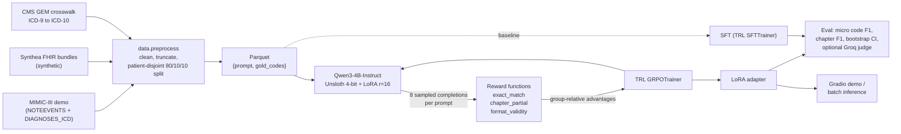

# ClinicalGRPO

**Reinforcement learning with verifiable rewards (RLVR) for clinical coding: post-training Qwen3-4B-Instruct with GRPO to read a hospital discharge summary and emit its ICD-10-CM diagnosis codes.**

[](https://github.com/TirtheshJani/ClinicalGRPO/actions/workflows/ci.yml)
[](https://github.com/TirtheshJani/ClinicalGRPO/blob/main/LICENSE)
[](https://github.com/TirtheshJani/ClinicalGRPO/blob/main/pyproject.toml)

## Why this is interesting

Most public GRPO demos optimize a small model on GSM8K arithmetic, where the answer is a single number. ICD-10 coding is a harder and more realistic target for verifiable rewards: the answer is an unordered *set* of codes drawn from a vocabulary of roughly 70,000, gold labels are noisy, and the model can be partially right in clinically meaningful ways (the right disease family but the wrong specificity). This project turns that into a rule-based reward with no learned reward model and no LLM judge in the training loop. Every reward is a deterministic function of the model's JSON output and the gold code list, which makes it cheap, reproducible, and auditable. The reward is split into three separately logged components so the training curves tell you *why* the policy is improving (or reward hacking), and the whole pipeline is engineered to fit a single 16 GB consumer GPU via Unsloth 4-bit loading and LoRA.

## Architecture



The model is prompted (see `src/clinical_grpo/prompts/templates.py`) to answer with a single JSON object, `{"codes": ["E11.9", "I10", ...]}`. That output contract is the interface between generation and reward: `parse_completion` strips any Qwen3 `<think>...</think>` block, extracts the first JSON object, keeps only well-formed ICD-10 codes, normalizes them (uppercase, dot after the category) and de-duplicates. An SFT baseline trained on the same splits and prompts provides the controlled comparison for GRPO.

## Reward design

GRPO samples a group of 8 completions per discharge summary and scores each one. Three reward callables are registered with TRL (`src/clinical_grpo/rewards/composite.py`), and TRL sums them into the scalar used for group-relative advantages while logging each one as its own curve.

| Reward | Range | What it measures |
|---|---|---|
| `exact_match_reward` | 0 to 1 | Recall of the gold code set: exact matches divided by the number of gold codes. |
| `chapter_partial_reward` | -0.1 and up (see known issue) | `0.3 x` (wrong codes that land in a gold ICD-10 chapter / number of gold codes), minus `0.1 x` (codes outside every gold chapter / number of predictions). |
| `format_validity_reward` | -0.5 or 0 | Penalizes any completion that does not parse into the `{"codes": [...]}` contract. |

A few design choices are deliberate. Malformed output is actively penalized rather than scored zero, so formatting failures are always worse than an honest empty answer. Chapter credit only goes to codes that are wrong but in the right chapter, so it never double counts an exact match, and its 0.3 weight keeps a single near-miss worth much less than an exact hit. ICD-9 style strings (purely numeric) fail validation and earn no chapter credit, closing an obvious reward-hacking route. The weights live in `configs/train.yaml` under `rewards:`.

**Known issue.** The chapter term is normalized by the number of gold codes, not by the number of predictions, so it is not bounded: a completion that lists many plausible codes from the gold chapters can out-score a perfect answer (32 in-chapter guesses against 3 gold codes score 3.2 on this term alone). Because GRPO optimizes relative reward within a group, the policy could learn to over-predict. This should be fixed before a long run, for example by capping the term or moving to a single weighted-F1 reward (planned, see CLAUDE.md), and it is why precision-sensitive F1 (not recall) is the headline evaluation metric.

You can see the scores on concrete completions without a GPU (output from `python examples/score_completion.py`, gold codes `E11.9, I10, N17.9`):

```text
sample             exact_match   chapter   format   total  parsed
-----------------------------------------------------------------
perfect                  1.000     0.000     0.00   1.000  ['E11.9', 'I10', 'N17.9']
right_chapter            0.333     0.100     0.00   0.433  ['E11.9', 'I12.9']
hallucinating            0.333    -0.050     0.00   0.283  ['E11.9', 'S72.001A']
with_think_block         0.667     0.000     0.00   0.667  ['I10', 'E11.9']
malformed                0.000     0.000    -0.50  -0.500  None
```

## Quickstart

### CPU only (no GPU, no data download)

This path installs the package, runs the same lint, type check and test suite as CI, and scores sample completions with the real reward functions. It was verified on Linux with Python 3.11. The dependency list includes Unsloth, PyTorch and bitsandbytes because they are needed for training, but the CPU tests never import them, so a CPU-only machine is fine.

```bash
git clone https://github.com/TirtheshJani/ClinicalGRPO.git
cd ClinicalGRPO
python -m venv .venv && source .venv/bin/activate
pip install -e ".[dev]"

# Same checks as .github/workflows/ci.yml
ruff check .
python -m mypy src/clinical_grpo/utils/ src/clinical_grpo/rewards/ \
  src/clinical_grpo/prompts/ src/clinical_grpo/eval/f1.py \
  src/clinical_grpo/data/dataset.py src/clinical_grpo/data/preprocess.py \
  --ignore-missing-imports
pytest tests/ -q --ignore=tests/test_smoke_train.py

# Score sample completions with the GRPO reward functions
python examples/score_completion.py
```

GPU-marked tests (`tests/test_smoke_train.py`, `tests/test_smoke_sft.py`) skip automatically when CUDA is unavailable.

### GPU training (CUDA required)

The default profile targets an RTX 4080 (16 GB). Profiles for A100 and T4 are in `configs/hardware/`.

**1. Get data.** The ICD-9 to ICD-10 crosswalk downloads automatically. The MIMIC-III demo's structured tables are open access, but its `NOTEEVENTS.csv` (the discharge summaries) is a header-only stub unless you complete PhysioNet credentialing and sign the data use agreement. `scripts/setup_data.py` checks all of this and prints what is missing.

```bash
python scripts/download_gem.py                    # CMS GEM crosswalk -> data/raw/gem/
python scripts/setup_data.py                      # checks data/raw/mimic-iii-demo and data/raw/synthea/fhir
python -m clinical_grpo.data.preprocess --source mimic_demo --out data/processed/mimic.parquet
python scripts/validate_data.py data/processed/mimic.parquet
```

Preprocessing writes `mimic.parquet` (train), `mimic_val.parquet` and `mimic_test.parquet`. Synthetic data from [Synthea](https://github.com/synthetichealth/synthea) works the same way with `--source synthea`.

**2. Smoke test, then train.** The smoke test runs one full GRPO step on a tiny synthetic dataset and checks that the loss is finite, all three reward names are logged, the adapter reloads, and generation parses. Run it before any long job.

```bash
pytest tests/test_smoke_train.py -k one_step -x   # GPU required, a few minutes

python scripts/train_sft.py --config configs/train.yaml --hw configs/hardware/rtx4080.yaml   # SFT baseline
python scripts/train.py     --config configs/train.yaml --hw configs/hardware/rtx4080.yaml   # GRPO
```

**3. Evaluate and serve.**

```bash
python scripts/eval.py --adapter outputs/grpo/adapter --split test                # micro F1, chapter F1, bootstrap CI
python scripts/eval.py --adapter outputs/grpo/adapter --split test --judge groq   # needs GROQ_API_KEY
python scripts/batch_infer.py --adapter outputs/grpo/adapter --input data/processed/mimic_test.parquet

pip install -e ".[app]"
ADAPTER_REPO=<your-hf-user>/<adapter-repo> python app/app.py                      # Gradio demo
```

`scripts/sweep.py` runs a grid over `configs/sweep.yaml`, and `scripts/push_to_hub.py` uploads an adapter to the Hugging Face Hub.

## Results

**Results are pending.** The training, evaluation and inference code is complete and tested, but no full SFT or GRPO run has been completed yet, so there are no F1 numbers to report. The blocker is data access: the discharge-summary notes require PhysioNet credentialing. The run plan is in `docs/plans/2026-05-18-phase3-experiment-execution.md`. When runs finish, this section will report micro code F1 and chapter F1 with bootstrap confidence intervals for the base model, the SFT baseline, and GRPO on the same patient-disjoint test split.

## Repository layout

```text
src/clinical_grpo/
  data/          MIMIC-III demo + Synthea loaders, ICD-9->10 mapping, preprocessing, HF dataset
  prompts/       system/user prompt and the {"codes": [...]} output contract
  rewards/       parse_completion and the three TRL reward functions
  training/      train_grpo.py (Unsloth + GRPOTrainer), train_sft.py (SFT baseline)
  eval/          code and chapter F1, bootstrap CIs, optional Groq LLM judge, eval harness
  utils/icd10.py code normalization, validation, chapter lookup
  inference.py   ICD10Predictor wrapper for a trained adapter
configs/         model, GRPO/SFT hyperparameters, reward weights, sweep, hardware profiles
scripts/         CLIs: data setup, train, train_sft, eval, batch_infer, sweep, push_to_hub
examples/        CPU-only reward walkthrough
app/             Gradio app for Hugging Face Spaces (ZeroGPU)
tests/           pytest suite (CPU) plus GPU smoke tests
docs/plans/      phase-by-phase implementation and run plans
```

## Tech stack

Python 3.10+, [TRL](https://github.com/huggingface/trl) `GRPOTrainer` and `SFTTrainer`, [Unsloth](https://github.com/unslothai/unsloth) for 4-bit loading and fast LoRA, PEFT, Hugging Face Transformers and Datasets, pandas and PyArrow for data, Gradio for the demo, pytest, ruff and mypy in GitHub Actions CI.

## Limitations and ethics

This is a research and portfolio project. **It is not a medical device and must not be used for clinical coding, billing, or any decision about patient care.** Predicted codes can be wrong, incomplete, or plausible-looking but unsupported by the note.

MIMIC-III is credentialed data. Anyone using it must complete PhysioNet credentialing and comply with its data use agreement, which prohibits redistributing the data and sharing it with third-party services. Do not commit MIMIC data or model outputs that contain note text to a public repository, and think carefully before sending MIMIC text to external APIs such as the optional Groq judge. The `data/` and `outputs/` directories are gitignored for this reason.

There are also methodological limits. The 100-patient MIMIC-III demo is very small, so any evaluation on it has wide confidence intervals. Gold codes are mapped from ICD-9 to ICD-10 through the CMS General Equivalence Mappings, which are approximate and sometimes one-to-many, so the labels are noisier than native ICD-10 coding. Notes are truncated to about 2,048 tokens, which can cut off diagnoses documented late in long summaries. Synthea data is synthetic and much easier than real notes.

## Contributing

See [CONTRIBUTING.md](CONTRIBUTING.md).

## Citation

If you use this code, please cite it using the metadata in [CITATION.cff](CITATION.cff).

## License

MIT, see [LICENSE](LICENSE). MIMIC-III and other datasets are governed by their own licenses and are not distributed with this repository.

## Author

Tirthesh Jani ([@TirtheshJani](https://github.com/TirtheshJani))
